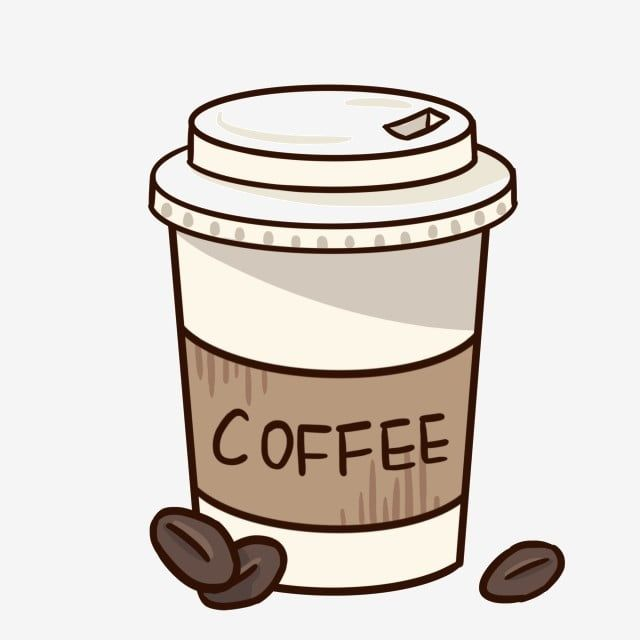

# CoffeApp

CoffeApp, Flutter ile ürün hissi olan sade ama karakterli bir kahve uygulaması denemesidir. Bu repo, daha hafif ölçekli bir proje üzerinden arayüz düzeni, görsel ton ve kullanıcı akışı pratiğimi göstermesi açısından önemlidir.

## Proje Özeti

- Flutter ile geliştirilen kahve temalı mobil uygulama
- UI odaklı ürün yaklaşımı
- Listeleme, görsel sunum ve akış hissi üzerine çalışma
- Daha temiz ve sade ekran kompozisyonları

## Kullandığım Teknolojiler

- Flutter
- Dart
- Dio
- Riverpod
- CachedNetworkImage
- Shimmer

## Projede Odaklandığım Alanlar

- Kullanıcıyı yormayan ekran düzeni
- Kart yapıları ve içerik sunumu
- Görsel hiyerarşi
- Akıcı mobil arayüz hissi

## Görsel

## Neden Bu Repo Değerli?

Her proje büyük ve kompleks olmak zorunda değil. CoffeApp, küçük ölçekte bile temiz ürün düşüncesi ve görsel karar verebildiğimi gösteren iyi bir destekleyici çalışma.

## İletişim

- GitHub: [github.com/kemalgokkaya](https://github.com/kemalgokkaya)
- Portfolyo: [portfolyo-jade-six.vercel.app](https://portfolyo-jade-six.vercel.app)
- E-posta: [kemalgokkaya8@gmail.com](mailto:kemalgokkaya8@gmail.com)
